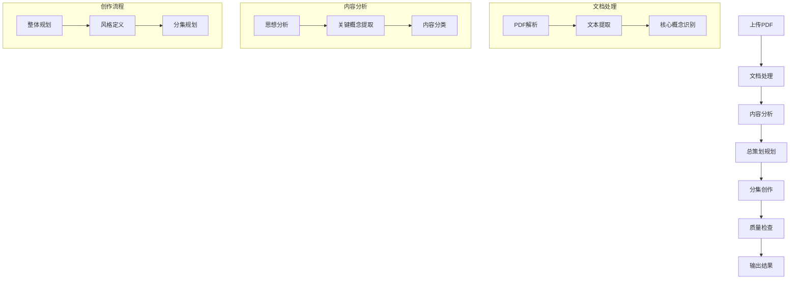
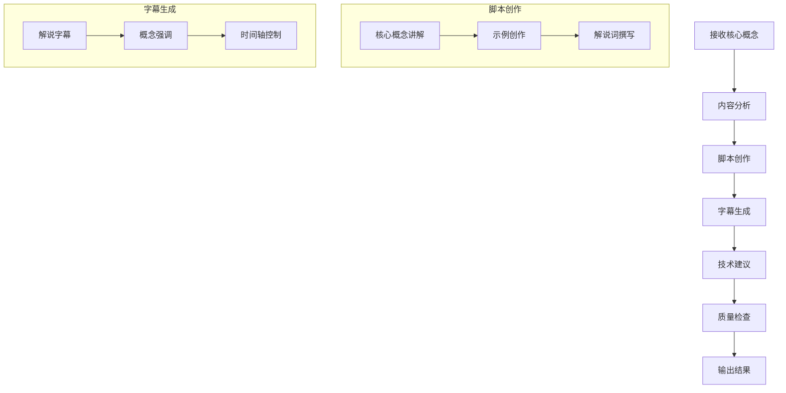

# 电子书转短视频单人解析系统需求文档

## 1. 项目概述

### 1.1 项目目标
将电子书（PDF格式）自动转换为短视频单人解析脚本和字幕，专注于提取和解释电子书的核心概念和中心思想。**每集视频长度控制在3分钟左右，系统不负责实际视频制作，仅输出脚本和字幕文件**。

### 1.2 项目范围
**包含的功能**：
- PDF文档处理与分析
- 核心思想和关键概念提取
- 单人解说视频脚本创作（针对3分钟左右长度）
- 通俗易懂的示例生成
- 字幕文件生成
- 创作质量保证

**不包含的功能**：
- 实际视频制作
- 视觉效果生成
- 音频内容创作
- 实际视频发布

### 1.3 业务价值
- 大幅提高知识内容创作效率
- 实现复杂电子书内容的精炼与通俗化
- 为内容创作者提供高质量讲解素材
- 降低知识型视频的前期准备成本
- 帮助受众更快理解书籍核心思想

### 1.4 核心功能
- PDF文档处理
- 核心思想提取与分析
- 解说脚本创作与示例生成
- 字幕生成
- 创作质量保证

## 2. 系统架构

### 2.1 整体架构
```
[用户输入层]
    ↓
[文档处理层] → [内容分析层] → [创作层] → [输出层]
    ↑              ↑             ↑
    └──────────[存储层]──────────┘
```

### 2.2 核心组件
1. 总策划Agent (PlannerAgent)
2. 单集创作Agent (EpisodeAgent)
3. 文档处理模块
4. 存储系统
5. 工作流编排系统

## 3. 详细功能需求

### 3.1 文档处理模块
1. **PDF处理**
   - 支持PDF文件上传
   - 文本提取和清理
   - 章节识别和分割
   - 格式标准化

2. **文本分析**
   - 核心思想识别
   - 关键概念提取
   - 重要观点标记
   - 内容分类和优先级排序

3. **输出控制**
   - 控制脚本内容量适合3分钟视频长度
   - 自动估算解说内容所需时间
   - 根据时长要求对概念解释进行优化调整

### 3.2 总策划Agent功能
1. **整体规划**
   - 识别书籍核心思想
   - 确定总集数
   - 规划每集主题和核心概念
   - 设计整体知识架构
   - 控制讲解节奏

2. **风格管理**
   - 定义解说风格
   - 设定目标受众
   - 制定讲解规则
   - 确保风格统一

3. **质量控制**
   - 内容准确性审核
   - 概念解释清晰度检查
   - 示例相关性验证
   - 专业性与通俗性平衡

4. **时长管理**
   - 确保每集视频脚本适合3分钟时长
   - 平衡各集内容，避免信息密度不均
   - 管理讲解节奏以适应短视频形式
   - 制定内容取舍原则

### 3.3 单集创作Agent功能
1. **内容创作**
   - 概念讲解设计
   - 通俗易懂示例生成
   - 解说词创作
   - 视觉参考建议

2. **字幕生成**
   - 解说字幕
   - 重点概念强调
   - 字幕样式
   - 时间轴控制

3. **技术建议**
   - 解说风格建议
   - 配乐氛围推荐
   - 视觉辅助元素建议
   - 重点展示方案

4. **输出格式**
   - 生成标准解说脚本格式
   - 创建与主流视频编辑软件兼容的字幕文件
   - 提供解说时间规划
   - 确保输出文件的可用性

## 4. 工作流程

### 4.1 主流程图


### 4.2 单集创作流程图


## 5. 数据模型

### 5.1 文档数据
```typescript
interface Document {
    id: string;
    title: string;
    chapters: Chapter[];
    coreIdeas: CoreIdea[];
    metadata: DocumentMetadata;
}

interface Chapter {
    id: string;
    title: string;
    content: string;
    order: number;
    keyPoints: KeyPoint[];
    metadata: ChapterMetadata;
}

interface CoreIdea {
    id: string;
    title: string;
    description: string;
    relatedChapters: string[]; // 章节ID列表
    importance: number; // 重要性评分
}

interface KeyPoint {
    id: string;
    concept: string;
    explanation: string;
    importance: number;
}
```

### 5.2 创作数据
```typescript
interface Episode {
    id: string;
    title: string;
    coreIdeaId: string;
    estimatedDuration: string; // 预计视频时长
    script: Script;
    subtitles: Subtitle[];
    technicalNotes: TechnicalNote[];
}

interface Script {
    introduction: string;
    conceptExplanation: string;
    examples: Example[];
    conclusion: string;
    visualCues: VisualCue[];
    estimatedSegmentDurations: Map<string, number>; // 每个段落估计时长
}

interface Example {
    id: string;
    situation: string;
    explanation: string;
    relevance: string;
    estimatedDuration: number;
}

interface Subtitle {
    id: string;
    text: string;
    startTime: string; // 格式如 "00:00:12,500"
    endTime: string;
    emphasis: boolean; // 是否需要强调
}

interface VisualCue {
    id: string;
    description: string;
    timecode: string;
    purpose: string;
}
```

## 6. 输出要求

### 6.1 脚本输出
- 标准单人解说视频脚本格式
- 每集控制在3分钟内容量
- 包含概念讲解和示例说明
- 提供视觉元素建议和重点提示

### 6.2 字幕输出
- 支持SRT/VTT等通用字幕格式
- 包含时间码信息
- 标记重点概念和关键词
- 结构清晰便于阅读

### 6.3 输出文件组织
- 按集数组织文件夹
- 提供整体内容索引
- 包含元数据信息
- 提供便于后期制作的文件命名规范

## 7. 技术需求

### 7.1 核心框架
- LangGraph：工作流编排
- LangChain：AI 应用开发
- TypeScript：开发语言

### 7.2 存储系统
- 文档存储：文件系统
- 向量存储：Chroma/FAISS
- 关系数据：SQLite/PostgreSQL

### 7.3 AI 模型
- 大语言模型：GPT-4/Claude
- 文本分析模型
- 向量嵌入模型

## 8. 质量保证

### 8.1 内容质量
- 概念解释准确性
- 示例相关性和通俗性
- 解说风格一致性
- 内容完整性验证
- 3分钟内容量是否合理
- 核心思想是否清晰表达
- 是否符合短视频知识传播特点

### 8.2 技术质量
- 代码质量检查
- 性能测试
- 错误处理
- 日志记录

## 9. 验收标准

### 9.1 功能验收
- 能够成功处理不同领域的PDF电子书
- 能够正确识别核心思想和关键概念
- 生成符合3分钟长度要求的解说脚本
- 输出格式规范的字幕文件
- 创建通俗易懂的示例

### 9.2 质量验收
- 核心思想提取准确性
- 概念解释清晰度
- 示例相关性和通俗性
- 各集内容逻辑连贯性
- 解说风格符合知识传播需求

### 9.3 性能验收
- 处理200页PDF的平均时间
- 系统资源占用情况
- 批处理性能表现

## 10. 后续优化方向

### 10.1 功能扩展
- 支持更多文档格式
- 添加视频参考画面生成
- 支持多语言处理
- 添加用户反馈机制
- 生成配套图表和视觉辅助材料

### 10.2 性能优化
- 并行处理优化
- 缓存机制
- 资源使用优化
- 响应速度提升

### 10.3 用户体验
- 添加进度显示
- 提供脚本预览功能
- 支持手动调整核心概念优先级
- 添加批处理功能

### 10.4 制作辅助
- 为实际视频制作提供更多可视化建议
- 生成讲解视觉辅助素材
- 提供配乐风格参考
- 添加解说技巧建议 