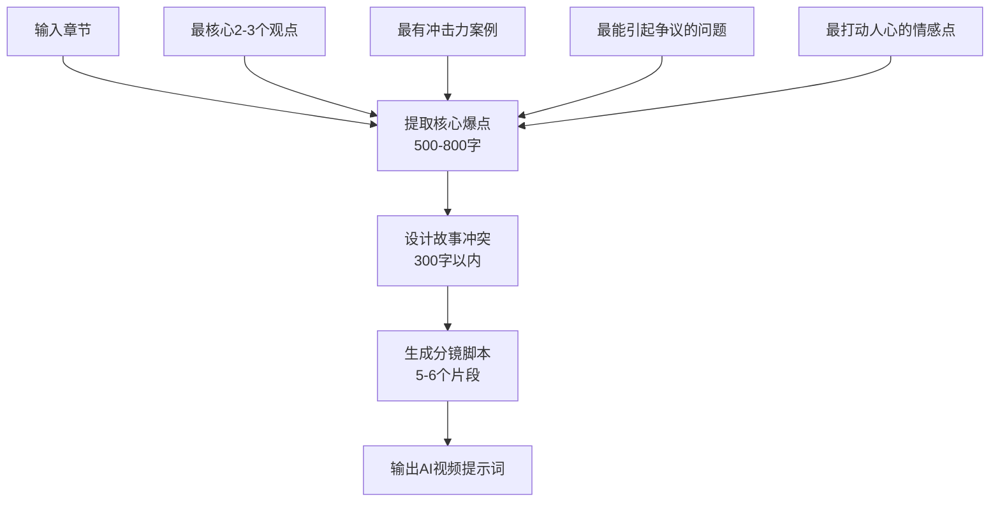

# 书籍内容故事化视频创作系统需求文档

## 1. 项目概述

### 1.1 项目目标
将书籍内容（PDF/EPUB格式）自动转换为**有故事情节、冲突矛盾、爆点**的AI视频脚本。通过动物角色和戏剧化叙事，让抽象知识变得生动有趣，激发观看兴趣的同时传播知识。

**核心理念**：知识内容 + 故事化包装 + 戏剧冲突 = 吸引人的教育视频

### 1.2 项目范围
**包含的功能**：
- 书籍内容智能提炼（重点突破法）
- 故事情节和角色冲突设计
- 分镜脚本创作（带爆点和悬念）
- AI视频生成提示词输出
- 三种不同的处理策略

**不包含的功能**：
- 实际视频制作（只输出脚本和提示词）
- 音频内容创作
- 复杂的数据结构管理
- 向量数据库存储

### 1.3 创新亮点
- **故事化知识传播**：将枯燥概念包装成有趣故事
- **角色化表达**：动物角色代表不同观点和立场
- **冲突驱动**：用戏剧冲突推动知识点展开
- **爆点设计**：每个片段都有吸引人的转折点
- **极简工程**：去除复杂架构，专注核心功能

### 1.4 目标受众
- 知识型短视频创作者
- 教育内容制作团队
- 自媒体运营者
- 想要将书籍内容可视化的个人创作者

## 2. 三种处理策略

### 2.1 策略A：章节拆解法
**适用场景**：完整性要求高的书籍
- 将整章按逻辑单元拆分为5-8个小节
- 每个小节单独故事化（1500-2000字处理）
- 用总体框架串联各个部分
- **优势**：内容覆盖全面，逻辑完整
- **劣势**：可能出现平均化问题

### 2.2 策略B：重点突破法 ⭐️
**适用场景**：追求爆点和吸引力
- 只选择章节中**最精彩的2-3个核心点**
- 深度故事化这几个重点内容
- 其他内容作为背景信息简单交代
- **优势**：突出重点，爆点集中，吸引力强
- **劣势**：内容覆盖不够全面

### 2.3 策略C：多轮对话法
**适用场景**：复杂内容需要深度挖掘
- 第1轮：AI提出5个最关键的问题
- 第2轮：围绕问题设计故事情节
- 第3轮：细化每个情节的视觉呈现
- 第4轮：优化冲突和爆点设计
- **优势**：深度挖掘，精雕细琢
- **劣势**：处理时间较长

## 3. 故事化框架

### 3.1 角色设定体系
**固定主角团队**：
- 🦊 **狐狸（智慧型）**：喜欢思考，代表理论派，性格严谨
- 🐻 **熊（行动型）**：喜欢实践，代表实用派，性格直接
- 🐰 **兔子（好奇型）**：爱问问题，代表观众视角，性格活泼

**反派角色体系**：
- **"误解先生"**：代表常见的错误观念
- **"偏见女士"**：代表固化思维
- **"懒惰虫"**：代表拖延和逃避

### 3.2 冲突设计公式
```
经典三幕结构：
第一幕：遇到问题/困惑 → 制造悬念
第二幕：探索解决方案 → 多重冲突  
第三幕：获得顿悟 → 情感高潮
```

### 3.3 爆点设计类型
- **认知冲突**：打破常识的瞬间
- **情感转折**：从绝望到希望的反转
- **智慧顿悟**：复杂问题的简单答案
- **意外反转**：角色立场的180度转变
- **悬念揭晓**：谜底揭开的快感

## 4. 技术架构（极简版）

### 4.1 核心组件
```
输入层：书籍文件解析
处理层：内容提炼 → 故事设计 → 脚本生成
输出层：脚本文件 + AI视频提示词
```

### 4.2 数据流（无复杂结构）
```
原始章节内容(string) 
    ↓
核心爆点提炼(string)
    ↓  
故事冲突设计(string)
    ↓
分镜脚本生成(简单JSON)
    ↓
提示词输出(string)
```

### 4.3 极简数据结构
```typescript
// 只保留最必要的结构
interface SimpleChapter {
  title: string;
  content: string;
  order: number;
}

interface SimpleVideoScript {
  title: string;
  order: number;
  story: string;           // 故事内容
  visualPrompts: string[]; // AI视频提示词
  duration: number;        // 预估时长
}
```

## 5. 工作流程

### 5.1 策略B处理流程（重点突破法）


### 5.2 内容处理细节
**第一步：核心爆点提取**
- 输入：原始章节内容（限制8000字以内）
- 输出：800字以内的核心要点总结
- 重点：突出能做成有趣视频的部分

**第二步：故事冲突设计**  
- 输入：核心爆点
- 输出：300字以内的冲突框架
- 包含：角色设定、核心冲突、戏剧张力、情感钩子

**第三步：分镜脚本生成**
- 输入：核心爆点 + 故事冲突
- 输出：5-6个分镜，每个100-150字
- 要求：起承转合、小爆点、动物角色、知识融入

## 6. 输出规格

### 6.1 脚本文件格式
```markdown
# 视频脚本方案

## 1. 狐狸的智慧觉醒
**时长:** 45秒
**故事内容:** 狐狸发现了一个奇怪现象...
**视觉关键词:** 动漫风格, 森林场景, 狐狸思考, 问号特效
```

### 6.2 AI视频提示词格式
```
## 狐狸的智慧觉醒
时长: 45秒
提示词: 动漫风格，森林场景，聪明狐狸，思考状态，问号特效，生动有趣，教育性强
场景描述: 狐狸在森林中发现奇怪现象，陷入深思...
```

### 6.3 文件输出清单
- `video-scripts-detail.json` - 详细脚本数据
- `video-scripts-readable.md` - 人类可读版本  
- `jimeng-prompts.txt` - 即梦AI提示词
- `strategy-comparison.md` - 三种策略对比结果（可选）

## 7. 质量标准

### 7.1 故事质量
- ✅ 是否有清晰的戏剧冲突？
- ✅ 是否有情感共鸣点？
- ✅ 每个片段是否有小爆点？
- ✅ 角色是否生动有趣？
- ✅ 知识点是否自然融入？

### 7.2 实用性
- ✅ 提示词是否适合AI视频生成？
- ✅ 时长控制是否合理？
- ✅ 是否保留了原书核心价值？
- ✅ 是否适合目标受众观看？

## 8. 技术实现

### 8.1 开发框架
- **语言**：TypeScript
- **AI模型**：GPT-4/Claude
- **文档解析**：现有PDF/EPUB解析器
- **无需**：LangGraph、向量数据库、复杂状态管理

### 8.2 核心类设计
```typescript
class SimpleBookToVideo {
  // 策略B：重点突破法
  async processChapter(chapter: SimpleChapter): Promise<SimpleVideoScript[]>
  
  // 核心步骤
  private async extractCorePoints(content: string): Promise<string>
  private async designStoryConflict(corePoints: string): Promise<string>  
  private async generateVideoScripts(corePoints: string, conflict: string): Promise<SimpleVideoScript[]>
}
```

## 9. 使用方式

### 9.1 命令行调用
```bash
# 策略B处理
npm run simple <书籍文件> [输出目录]

# 未来扩展：三策略对比
npm run compare <书籍文件> [输出目录]
```

### 9.2 处理示例
```bash
npm run simple ./assets/原则.epub ./output
# 输出：
# - 从3章内容生成15-18个视频片段
# - 每个片段30-60秒，适合短视频
# - 包含完整的AI视频提示词
```

## 10. 后续发展

### 10.1 功能增强
- 实现三种策略完整版本
- 添加策略效果对比功能
- 支持风格定制（科幻、童话、现代等）
- 添加不同年龄段适配

### 10.2 工程优化
- 保持极简架构不变
- 优化提示词效果
- 提升处理速度
- 增加错误处理

### 10.3 生态集成
- 与主流AI视频工具深度集成
- 提供更多视觉风格选项
- 支持批量处理
- 添加质量评估机制

---

**设计理念**：极简而强大，专注而有效。用最少的代码实现最大的价值。 